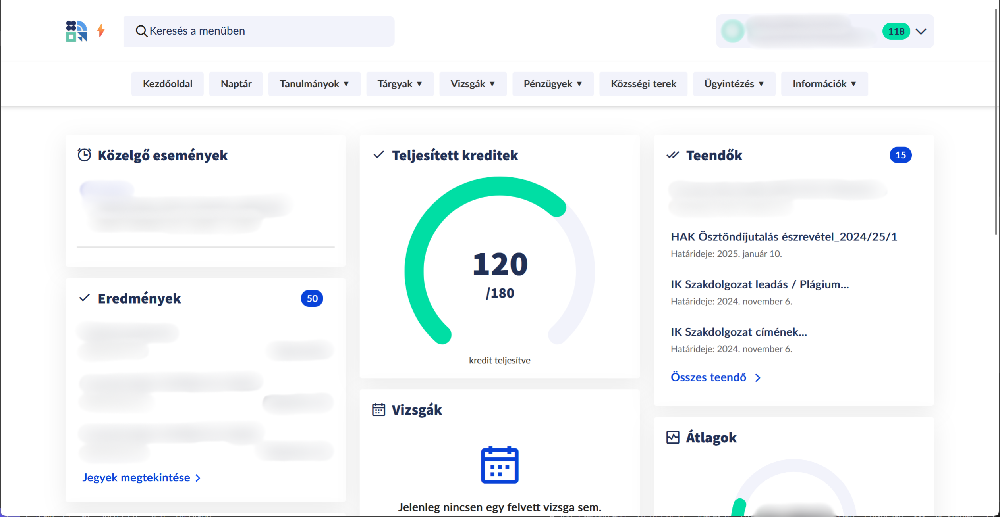

<h1 align="center">Neptun Plus</h1>

⚡

A Neptun Plus egy felhasználói szkript, amely javítja a Neptun ÚJ felületét, felhasználóbarátabbá és könnyebben navigálhatóvá téve azt. Ez a szkript a Debreceni Egyetem Neptun rendszerét használó hallgatók számára működik.

  

## Funkciók

- 🚀 Egyszerűsített navigációs menü
- 💡 Fejlesztett felhasználói felület és dizájn
- ⚡ Gyors hozzáférés a gyakran használt funkciókhoz
- 📱 Reszponzív dizájn mobileszközökre
- 🔍 Fontos információk jobb láthatósága

🛠 <b>Automatikus kiléptetés blokkolása (hamarosan)</b>

## Telepítés

1. Telepíts egy (<i>javasolt</i>) felhasználói szkript kezelőt a böngésződhöz:
   - Chrome-hoz: [Tampermonkey](https://chrome.google.com/webstore/detail/tampermonkey/dhdgffkkebhmkfjojejmpbldmpobfkfo)
   - Firefox-hoz: [Greasemonkey](https://addons.mozilla.org/en-US/firefox/addon/greasemonkey/)

2. Kattints erre a linkre a Neptun Plus szkript telepítéséhez: [Neptun Plus telepítése](https://github.com/palicz/neptun-plus/raw/refs/heads/main/neptun-plus.user.js)

3. Erősítsd meg a telepítést, amikor a felhasználói szkript kezelő kéri.

4. Frissítsd a Neptun oldalt a változások megtekintéséhez.

## Használat

A telepítés után a szkript automatikusan fut, amikor meglátogatod a Neptun weboldalt. A következő változásokat fogod észrevenni:

- Egy villám ikon (⚡) a Neptun logó mellett, jelezve, hogy a Neptun Plus aktív
- Eltűnt a menügomb a navigációs sávon
- Új, intuitívabb navigációs menü az oldal tetején ami görgetéskor is látható, ezért nem kell visszatérni az oldal tetejére, hogy megnézd a menüt
- Az Kezdőlap fölösleges "<i>Tisztelt Jóska</i>" része eltűnt, illetve a Kezdőlap átrendezése gomb is, mivel az oldal dinamikusan rendezi magát a használat szerint
- A Kezdőlapon található korábban lenyitható információs kártyák már nem zárhatók és mindig nyitva vannak (<i>nem értem miért lett volna rá szükség, hogy azokat nyitni és zárni lehessen</i>)

A navigáláshoz egyszerűen kattints a menüelemekre. Az almenük megjelennek rámutatáskor (asztali gépen) vagy érintésre (mobilon).

## Kompatibilitás

A Neptun Plus jelenleg kompatibilis:

- A Debreceni Egyetem Neptun rendszerével
- Chrome és Firefox böngészőkkel (legújabb verziók)
- Asztali és mobileszközökkel

## Jogi nyilatkozat

A Neptun Plus a Neptun rendszer nem hivatalos kiegészítője. Nem áll kapcsolatban és nem támogatja a Debreceni Egyetem vagy a Neptun készítői. Használd saját belátásod szerint.

 